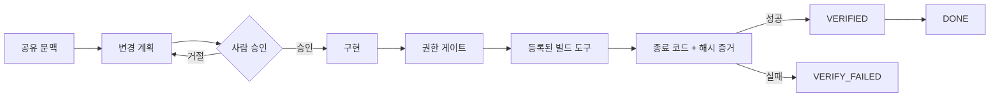

# Backend Team Harness

**백엔드 작업을 `공유 문맥 → 사람 승인 → 제한된 검증 → 재현 가능한 증거` 순서로 끝내게 만드는 로컬 실행 하네스입니다.**

현재 버전은 AI 모델을 호출하지 않습니다. 사람과 어떤 AI 도구를 쓰더라도 완료 판정은 모델의 말이 아니라 작업 상태, 빌드 종료 코드, 파일·출력 해시로 결정합니다.

## 지금 실제로 되는 것

- 기존 문서를 보존하며 `.backend-harness` 팀 계약을 초기화합니다.
- 심볼릭 링크, 홈·루트 경로, 묵시적인 강제 덮어쓰기를 거절합니다.
- `--force`로 바꾼 파일은 먼저 로컬 백업합니다.
- Gradle·Maven·Java·Flyway 파일의 **내용과 종류**를 검사합니다.
- 품질 게이트 YAML을 읽고 작은 명시적 스키마로 검증합니다.
- 작업 상태와 이벤트를 저장하고, 재실행 시 이벤트 로그로 복원합니다.
- 사람의 계획 승인 전에는 검증 도구를 실행할 수 없습니다.
- 프로젝트가 소유한 Gradle/Maven Wrapper만 오프라인 모드로 실행합니다.
- 명령, 종료 코드, 실행 시간, stdout/stderr 해시를 증거로 남깁니다. 출력 원문은 저장하지 않습니다.

## 한눈에 보는 실행 흐름



하네스가 소스코드를 자동으로 수정하지는 않습니다. 개발자는 평소 도구로 구현하고, 이 하네스는 합의된 작업 상태와 검증 경계를 지킵니다.

## 5분 사용법

Node.js 20 이상이 필요하며 외부 npm 패키지를 사용하지 않습니다.

```bash
git clone https://github.com/yeongwanho/backend-team-harness.git
cd backend-team-harness
npm test

# 1. 실제 백엔드 저장소에 공유 계약 생성
node src/cli.mjs init /path/to/backend-project

# 2. 파일 이름뿐 아니라 내용·종류·품질 게이트 검사
node src/cli.mjs doctor /path/to/backend-project

# 3. 팀이 공유할 작업 생성
node src/cli.mjs task create LC-123 /path/to/backend-project \
  --title "주문 상태 조회 추가" \
  --context "요구사항과 확인할 출처를 여기에 기록"

# 4. 문맥과 계획을 확인하고 상태 이동
node src/cli.mjs task advance LC-123 CONTEXT_READY /path/to/backend-project --by developer
node src/cli.mjs task plan LC-123 /path/to/backend-project \
  --text "변경 대상, 테스트, 위험과 제외 범위를 기록" \
  --by developer
node src/cli.mjs task advance LC-123 PLAN_PROPOSED /path/to/backend-project --by developer
node src/cli.mjs task advance LC-123 PLAN_APPROVED /path/to/backend-project --by reviewer --approve
node src/cli.mjs task advance LC-123 IMPLEMENTING /path/to/backend-project --by developer

# 5. 구현 후 프로젝트 Wrapper로 오프라인 테스트하고 증거 기록
node src/cli.mjs verify LC-123 /path/to/backend-project

# 6. VERIFIED인 작업만 사람이 완료 처리
node src/cli.mjs task advance LC-123 DONE /path/to/backend-project --by developer
```

`verify`는 임의의 셸 문자열을 받지 않습니다. 다음 중 프로젝트에 존재하는 실행 파일 하나만 선택합니다.

- `./gradlew test --offline --no-daemon --console=plain`
- `./mvnw -o -B test`

전역 Gradle/Maven, 배포, 운영 DB, 네트워크 도구는 기본 실행 범위에 없습니다.

## 생성되는 구조

```text
.backend-harness/
├── project.md                 # 서비스 목적과 범위
├── architecture.md            # 모듈·데이터·런타임 경계
├── glossary.md                # 팀 용어
├── policies/                  # API·DB·보안·오류 정책
├── workflows/                 # 작업 종류별 사람이 읽는 절차
├── quality-gates/             # doctor가 실제 파싱하는 YAML
├── decisions/                 # 설계 결정
├── tasks/<id>/
│   ├── task.md                # 사람이 읽는 작업 문맥
│   ├── task.json              # 현재 스냅샷
│   ├── events.jsonl           # 해시 체인으로 연결된 재생 가능한 상태 이벤트
│   └── evidence/              # 로컬 전용 검증 증거
└── local/                     # 잠금·백업·임시 상태, Git 제외
```

## 상태 이동 규칙

```text
CONTEXT_MISSING → CONTEXT_READY → PLAN_PROPOSED → PLAN_APPROVED
                                                       ↓
                                                IMPLEMENTING
                                                       ↓
                                                  VERIFYING
                                                ↙            ↘
                                      VERIFY_FAILED         VERIFIED → DONE
```

- `PLAN_APPROVED`에는 `--by`와 `--approve`가 모두 필요합니다.
- 등록된 도구는 허용 상태가 아니면 실행 전에 차단됩니다.
- `VERIFIED`에는 종료 코드가 성공한 증거가 필요합니다.
- `DONE`은 `VERIFIED`를 거치지 않고 도달할 수 없으며, 증거 파일이 없어지거나 바뀌어도 차단됩니다.
- 동시에 같은 상태를 바꾸면 잠금 안에서 하나만 적용됩니다.

## 현재 범위와 한계

### 구현됨

- [x] 경로·심볼릭 링크·백업 경계를 가진 프로젝트 초기화
- [x] 실제 파일과 내용을 보는 저장소 doctor
- [x] 품질 게이트 YAML 파싱과 스키마 진단
- [x] 작업 상태 머신, 이벤트 로그, 재시작 복원
- [x] 도구 Registry와 실행 전 권한 Gate
- [x] Gradle/Maven 오프라인 테스트와 Evidence 기록
- [x] 성공 증거 없이는 완료할 수 없는 상태 규칙

### 아직 구현하지 않음

- [ ] Spring Controller → Service → Repository 영향 분석
- [ ] JPA 변경 위험 분석
- [ ] 배포된 Flyway 파일의 기준선 비교
- [ ] OpenAPI 호환성 검사
- [ ] 개발자 간 Handoff Packet 내보내기
- [ ] Codex·Claude·GPT·로컬 모델 Provider Adapter
- [ ] 모델 컨텍스트 최소화와 비밀 제거 파이프라인

따라서 지금은 **AI 에이전트 OS가 아니라 백엔드 작업·검증 하네스 MVP**입니다. 모델 연결이 없으므로 “AI 하네스”라고 주장하지 않습니다.

## OMO에서 참고한 범위

OMO 코드를 복사하거나 패키지로 의존하지 않습니다. 다음 런타임 기법을 백엔드 팀용으로 작게 다시 구현했습니다.

- Core와 Backend Adapter 분리
- 명시적인 상태 전이와 거절 audit
- 이름으로 등록된 Tool Registry
- Tool 실행 전 권한 Gate
- 실제 명령 결과를 파일로 남기는 evidence 기반 완료 판정

OMO의 다중 에이전트, memory engine, 수십 개 lifecycle hook, 모델 라우팅은 가져오지 않았습니다. 자세한 구현 대응표는 [OMO Design Mapping](docs/OMO-DESIGN-MAPPING.md)에 있습니다.

## 공개 저장소 원칙

회사 코드, 티켓, 정책, 내부 URL과 로그는 이 저장소에 포함하지 않습니다. 프로젝트별 사내 규칙은 해당 회사 저장소의 비공개 `.backend-harness` Pack으로 관리하고, 공개 예제와 테스트는 합성 데이터만 사용합니다.

## 문서

- [Architecture](docs/ARCHITECTURE.md)
- [OMO Design Mapping](docs/OMO-DESIGN-MAPPING.md)
- [Roadmap](docs/ROADMAP.md)
- [Security](SECURITY.md)

## License

[MIT](LICENSE)
