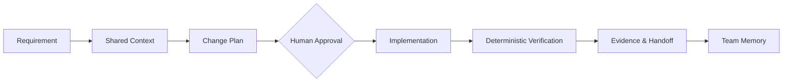

# Backend Team Harness

**백엔드 개발자와 AI가 같은 기획, 아키텍처, 작업 절차와 완료 기준을 공유하도록 만드는 provider-neutral 개발 하네스입니다.**

현재 저장소는 첫 번째 검증 가능한 기반을 제공합니다. `bth init`은 팀이 공유할 백엔드 작업 계약을 만들고, `bth doctor`는 저장소가 그 계약과 기본 빌드 구조를 갖췄는지 읽기 전용으로 검사합니다.

## 왜 필요한가

AI 코딩 도구를 팀원이 각자 사용하면 같은 요구사항도 다르게 해석하고, API·DB 변경과 테스트 근거가 흩어집니다. 이 프로젝트는 특정 모델의 프롬프트 모음이 아니라 다음 실행 순서를 고정합니다.



## 설계 원칙

- **사람이 기준이다.** AI는 계획과 설명을 돕지만 정책을 발명하거나 검증 결과를 선언하지 않습니다.
- **근거가 우선이다.** 테스트 종료 코드, Git diff, API 계약과 migration 결과가 모델의 주장보다 우선합니다.
- **Core와 Adapter를 분리한다.** 공통 실행 루프와 Spring·Gradle·JPA·Flyway·OpenAPI 지식을 독립시킵니다.
- **팀 지식과 개인 상태를 분리한다.** `.backend-harness`의 규칙은 공유하고, 비밀·캐시·생성 증거는 로컬에 둡니다.
- **모델에 종속되지 않는다.** Codex, Claude, GPT 또는 로컬 모델을 같은 도구 계약 뒤에 연결할 수 있어야 합니다.

## 빠르게 확인하기

Node.js 20 이상이 필요하며 외부 패키지는 사용하지 않습니다.

```bash
git clone https://github.com/yeongwanho/backend-team-harness.git
cd backend-team-harness
npm test

# 기존 Spring 프로젝트에 공유 계약 생성
node src/cli.mjs init /path/to/backend-project

# 프로젝트 상태를 읽기 전용으로 확인
node src/cli.mjs doctor /path/to/backend-project
```

`init`은 기존 파일을 덮어쓰지 않습니다. 생성되는 기본 구조는 다음과 같습니다.

```text
.backend-harness/
├── project.md
├── architecture.md
├── glossary.md
├── policies/
├── workflows/
├── quality-gates/
├── decisions/
└── tasks/
```

## 현재 범위: Foundation

- [x] 안전한 프로젝트 초기화
- [x] Gradle·Maven·Java·Flyway·공유 계약 진단
- [x] 사람과 AI가 함께 읽는 Markdown 템플릿
- [x] 회사 정보가 없는 합성 Spring 구조 예제
- [ ] 작업 Context Pack과 상태 머신
- [ ] Spring 코드 영향 분석 Adapter
- [ ] Gradle 선택 테스트와 Evidence 기록
- [ ] JPA·Flyway·OpenAPI 품질 게이트
- [ ] 모델 Provider Adapter
- [ ] 개발자 간 Handoff Packet

자세한 경계는 [Architecture](docs/ARCHITECTURE.md), 구현 순서는 [Roadmap](docs/ROADMAP.md)에서 확인할 수 있습니다.

## OMO에서 참고하는 것

OMO의 코드를 복사하지 않습니다. Core/Adapter 분리, 도구 계약, lifecycle hook, task state, 권한 경계, evidence 기반 QA라는 일반 설계 원리를 백엔드 협업 문제에 맞게 다시 설계합니다. 직접 코드 재사용이 필요해지면 별도로 라이선스와 출처를 검토합니다.

## 공개 저장소 원칙

회사 코드, 티켓, 정책, 내부 URL과 로그는 이 저장소에 포함하지 않습니다. 프로젝트별 사내 규칙은 별도의 비공개 Pack으로 유지하고, 공개 예제는 합성 데이터만 사용합니다.

## License

[MIT](LICENSE)

