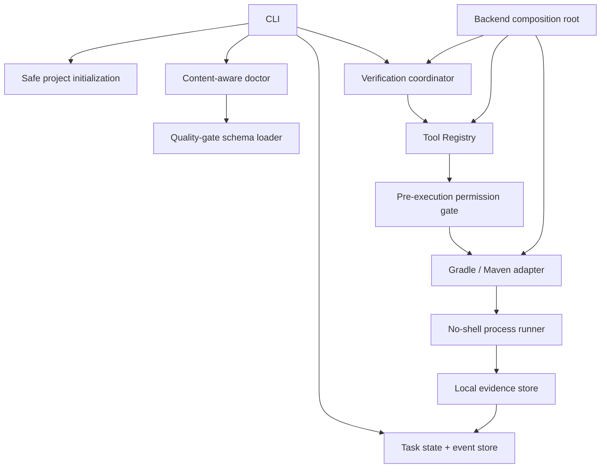
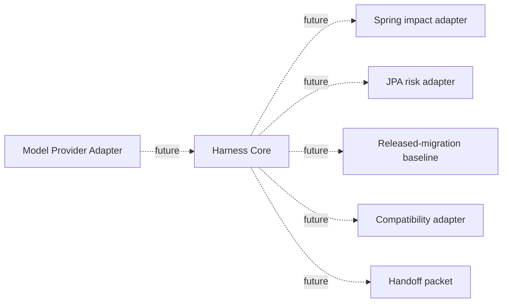

# Architecture

## Product boundary

Backend Team Harness is a local workflow runtime for a backend developer and reviewer. It persists task decisions, denies invalid execution, runs one narrow deterministic verification surface, and records machine evidence.

It is not currently a model host, autonomous coding agent, deployment platform, production database client, or replacement for human review.

## Implemented runtime



### Generic core

The modules under `src/core/` do not contain Spring- or company-specific policy.

- `task-state.mjs`: pure transition legality and audit result
- `task-store.mjs`: hash-chained shared event log, snapshot, path-safe task id, stale-lock recovery, and local lock
- `tool-registry.mjs`: named tool definitions and structured dispatch
- `process-runner.mjs`: no-shell execution with an environment allowlist and output hashing
- `evidence-store.mjs`: local immutable evidence records
- `verify-task.mjs`: state → injected tool registry → evidence → state coordination

### Backend adapter

`src/runtime/backend-harness.mjs` is the composition root. It injects the policy gate and backend adapter into the generic core. `src/adapters/build-test-tool.mjs` selects only a project-owned wrapper; it does not accept a user-provided command string and always adds offline flags.

### Policy boundary

`src/policy/tool-gate.mjs` runs before a registered tool. It can reject an invocation based on task state, network capability, or source-write capability before the tool's execute function is called.

### Project pack

`.backend-harness/` contains human-readable project context and strict quality-gate definitions. Project policy is data; it does not fork or import the generic core.

### Shared and local state

| Data | Shared by Git | Reason |
| --- | --- | --- |
| `tasks/<id>/task.md` | yes | human-readable context |
| `tasks/<id>/task.json` | yes | current reviewable snapshot |
| `tasks/<id>/events.jsonl` | yes | replayable decision history |
| `tasks/<id>/evidence/` | no | machine-specific command metadata |
| `local/locks/` | no | process coordination |
| `local/backups/` | no | recovery from explicit overwrite |

## Task state machine

The transition table is code in `src/core/task-state.mjs`, not a documentation-only diagram.

```text
CONTEXT_MISSING
  -> CONTEXT_READY
  -> PLAN_PROPOSED
  -> PLAN_APPROVED       (explicit actor + approval)
  -> IMPLEMENTING
  -> VERIFYING           (only registered tools may run)
  -> VERIFIED            (confirmed evidence required)
  -> DONE                (verified evidence retained)
```

`VERIFY_FAILED`, `CONTEXT_STALE`, `POLICY_BLOCKED`, and `PERMISSION_DENIED` preserve failure instead of turning it into a successful completion. An illegal transition returns `applied: false` with an audit reason and does not modify the event log.

`CONTEXT_READY` requires non-empty context, and `PLAN_PROPOSED` requires a stored plan. Changing context or a plan after approval invalidates that approval and returns the task to `CONTEXT_READY`.

Each event contains the previous event hash and its own SHA-256. Replay rejects a broken chain. This detects accidental or unreviewed edits; it is not a cryptographic signature against an attacker who can rewrite the entire repository.

## Evidence contract

A verification record contains:

- tool id and adapter
- fixed executable plus argument array
- start, finish, and duration
- exit code, signal, and timeout state
- stdout/stderr byte counts and SHA-256 hashes
- evidence-record SHA-256

Raw stdout and stderr are deliberately not stored. A result is confirmed only when the child process exits with code `0`, without a signal or timeout.

The persisted state store re-reads and hashes the referenced evidence before accepting `VERIFIED` or `DONE`. A caller-supplied evidence id or boolean is not trusted by itself.

## Safety properties

- Init accepts an existing project directory only.
- Filesystem root, user home, and symlinked write segments are rejected.
- Existing contract files are preserved by default.
- Explicit `--force` replacement creates byte-for-byte backups first.
- Task and evidence ids cannot contain path traversal.
- Tool dispatch is deny-before-execute.
- Process execution uses `shell: false`, an environment allowlist, project wrappers, and offline arguments.
- Deployment, production DB, secrets, and arbitrary commands have no registered tool.

## Planned, not implemented



The dotted components must not be described as current product capabilities until they have runtime modules and acceptance tests.
