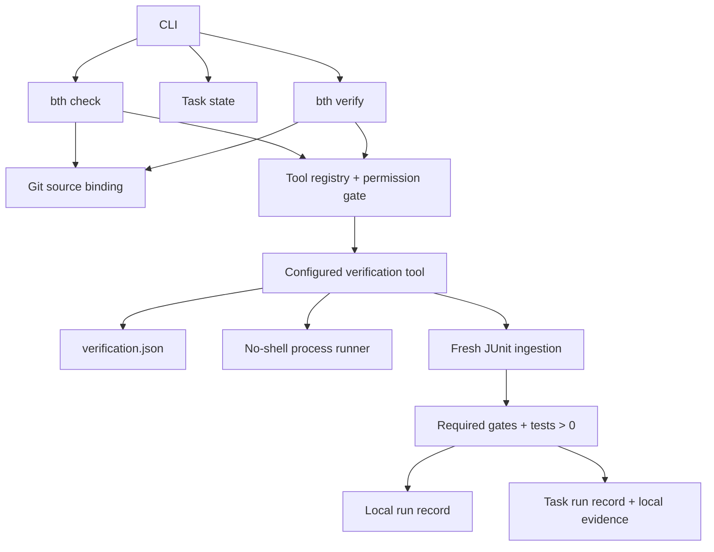

# Architecture

## Product boundary

Backend Team Harness closes one narrow gap: a claim that a change works must be tied to the Git source, commands, and fresh structured test results that produced the claim.

It is not a CI replacement, model host, deployment platform, production database client, static-analysis oracle, or sandbox for malicious repositories.

## Runtime



## Boundaries

### Generic core

- `source-binding.mjs`: commit, diff, and untracked-content fingerprint
- `process-runner.mjs`: allowlisted environment, no shell, timeout and process-group cleanup
- `junit.mjs`: safe report discovery, freshness check, test result parsing
- `task-state.mjs`: pure lifecycle transition rules
- `task-store.mjs`: event replay, snapshot, lock, evidence and source revalidation
- `verify-task.mjs`: approved task verification coordination
- `run-record-store.mjs`: redacted local/shared run summaries
- `evidence-store.mjs`: immutable local detailed records

### Project adapter

`src/adapters/verification-tool.mjs` is deliberately unaware of Spring, Gradle, Maven, Node, or database brands. It loads project data, resolves a project-contained executable, runs each gate, and applies the configured result contract.

### Project pack

`.backend-harness/verification.json` contains the executable integration boundary:

- project-owned command argv
- required/optional status
- timeout
- exit-code or JUnit result contract
- report patterns and minimum test count

Gradle and Maven are initialization defaults, not Core branches. Other ecosystems use the same schema.

The YAML files under `quality-gates/` remain human review checklists. They are not silently treated as executable verification.

## Source binding

A binding contains:

- `HEAD` commit
- project path inside the Git worktree
- status digest
- tracked binary-diff digest
- untracked file path/content digests
- one aggregate fingerprint

Task, local, and generated harness runtime paths are excluded so recording a run does not invalidate the run. Source, verification configuration, project scripts, and policy files remain included.

The binding detects accidental staleness. It is not a signature against an attacker who can rewrite the repository and records.

## Verdict contract

```text
PASS = every required gate passed
   AND at least one required JUnit gate exists
   AND fresh executed tests >= configured minimum
   AND failures = 0
   AND errors = 0
```

Exit code `0` alone is insufficient. A pre-existing report is insufficient. Optional gate failures are reported but do not change the required-gate verdict.

## Run records

| Record | Git | Purpose |
| --- | --- | --- |
| `.backend-harness/local/runs/latest.json` | ignored | fast `bth check` feedback |
| `tasks/<id>/runs/latest.json` | shareable | teammate-readable task result |
| `tasks/<id>/evidence/*.json` | ignored | detailed state-transition evidence |

Records contain no raw stdout/stderr. They contain command argv, exit metadata, byte counts, hashes, test statistics, report paths, source binding, runtime version, and a rerun argv.

## DB boundary

DB verification is a project gate, not a hard-coded universal lifecycle. A repository may call its existing Testcontainers, Docker Compose, embedded DB, Flyway, Liquibase, or Prisma workflow. A migration exit-code gate can run before a required integration-test JUnit gate.

This keeps the Core portable and prevents a second conflicting DB lifecycle. A managed DB Pack remains possible for projects that have no lifecycle of their own.

## Safety properties

- Project init and writes reject unsafe roots and symlink segments.
- Gate executables must be regular, executable, project-contained, and non-symlinked.
- Commands are argv arrays and run with `shell: false`.
- Parent environment values are allowlisted; common credential variables and `MAVEN_OPTS` are excluded.
- Timeouts kill the POSIX process group, not only the immediate child.
- Missing, stale, malformed, zero-test, failed, errored, timed-out, or signalled results cannot confirm verification.
- `DONE` rebinds the current Git source and rejects a post-verification change.

The project-owned executable remains trusted code and can perform network or filesystem actions. No OS sandbox currently enforces the declared capability metadata.

## Deferred

Code Graph is deferred until runtime observation proves a need. If added, coverage and SQL observations should be preferred over framework-wide guessed relationships, and graph output must never become the PASS oracle.
