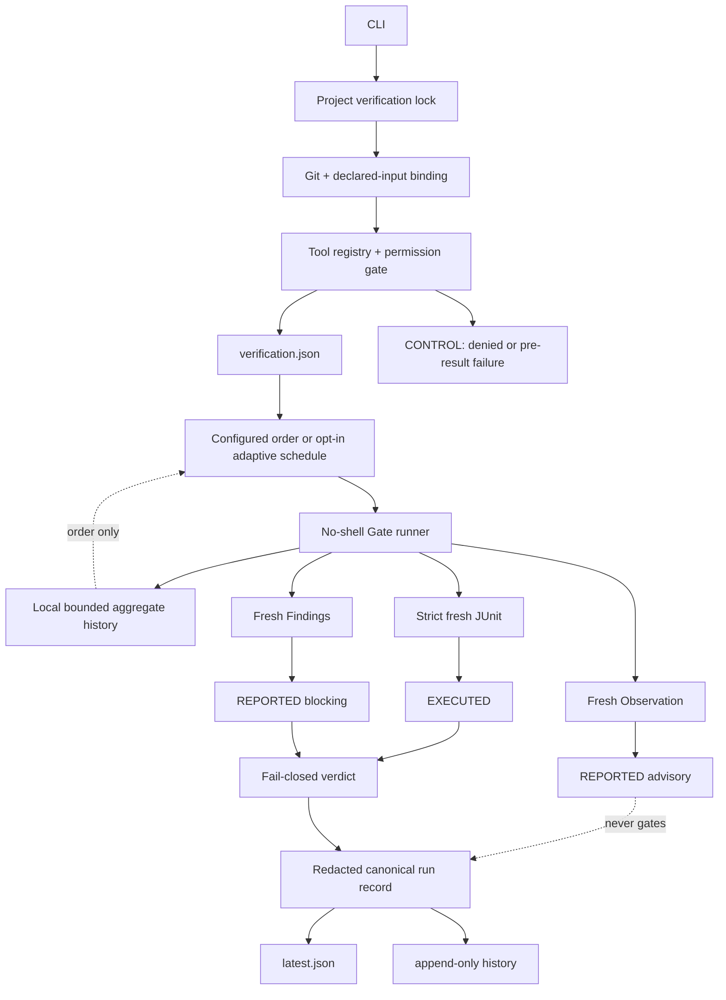
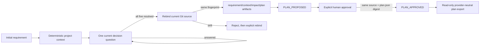

# Architecture

## Product boundary

Backend Team Harness closes one gap: a claim that a backend change works must be tied to the exact source, declared inputs, commands, toolchain, and fresh machine-readable results that produced it.

It is not a model host, CI replacement, deployment platform, production database client, full static-analysis oracle, or sandbox for malicious repositories.

## Runtime



`bth check` uses the explicit `CHECKING` operation. It does not forge a persisted task. `bth verify` first requires an approved task and uses `VERIFYING`.

## Native planning interview



The interview is native BTH behavior, not a runtime bridge to another harness or an LLM. Its question catalogue and transitions are versioned in `interview-state.mjs`. It records only explicit human decisions and deterministic repository observations; it does not claim semantic code impact that no tool or person established.

Interview persistence is under the owning task. `events.jsonl` is append-only and hash-chained, project-context snapshots are stored by digest, the four JSON artifacts are SHA-256 bound, and path/symlink/size limits match the existing task safety model. `unknown` and `conflict` answers remain the current question and fail closed. Project observations specialize the question hints but never create a human answer. `revise` changes one explicit decision; `rebind` preserves decisions while recording a fresh source and immutable context snapshot.

Finalization is crash-recoverable across the interview and task stores: finalized artifacts are authoritative and a retry may finish materializing the unchanged task plan. The resulting task enters `PLAN_PROPOSED`, never `PLAN_APPROVED`. Approval checks the planned source fingerprint and canonical `plan.json` digest, then records context/plan/artifact hashes plus actor and time. Any later context or plan update clears that receipt. The provider-neutral export is read-only and explicitly carries neither write authority nor verdict authority.

## Layers

### Generic Core

- `source-binding.mjs`: commit, diff, untracked, and explicit-input fingerprints
- `project-lock.mjs`: cross-process build/report ownership
- `process-runner.mjs`: allowlisted environment, no shell, timeout/process-group cleanup
- `junit.mjs`: bounded discovery, freshness, strict XML parsing, executed-count semantics
- `findings.mjs`: bounded project-relative Findings/Observation ingestion
- `toolchain.mjs`: executable hashes, Java and wrapper metadata
- `canonical-json.mjs`, `redaction.mjs`: stable hashes and shareable-record hygiene
- task state/store, evidence store, and run-record store
- native interview state/store and source-bound plan artifacts

### Configured adapter

`verification-tool.mjs` knows result contracts, not frameworks. It resolves each project-contained executable, selects configured order or an opt-in schedule, fails fast after a required failure, and rebinds source after execution.

Adaptive scheduling is deliberately narrower than test-impact analysis. Only contiguous required Gates marked `reorderable: true` can move. With Beta-smoothed failure probability `p_i` and observed mean duration `c_i`, eligible Gates are ordered by descending `p_i/c_i`, the pairwise optimum for an independent fail-fast model. A fixed or optional Gate is a hard boundary. Insufficient, missing, unsafe, or corrupt local history preserves configured order. The scheduler never removes a Gate and cannot alter evidence or verdict authority.

### Project contract and Packs

The project owns:

- command argv and timeout
- network declaration
- ignored but outcome-affecting input files
- JUnit/Findings report locations
- required/optional policy
- database lifecycle and test profile

Built-in Packs install this boundary; they do not bypass it.

## Evidence authority

```text
EXECUTED
├─ junit       may contribute positive PASS evidence
└─ exit-code   may prove a process step, never enough alone

REPORTED
├─ findings    may block PASS at declared severities
└─ observation may never change PASS

CONTROL
└─ permission denial or failure before a structured execution result; never PASS evidence
```

This is asymmetric on purpose. A static tool can detect a reason to stop, but “no findings” cannot prove runtime behavior.

## Verdict

```text
PASS = required gates all passed
   AND a required JUnit gate exists
   AND each required JUnit gate executed its minimum testcase count
   AND aggregate executed tests > 0
   AND failures = errors = 0
   AND source remained stable
```

`executed = testcase elements - truly skipped testcase elements`. A testcase containing failure/error is executed even if malformed producer output also includes `skipped`.

## Source and tool binding

Normal Git state does not include ignored inputs. The config therefore supports explicit `inputs`. Their path and content are hashed without writing their raw value into a run record.

Each run also binds the Gate executable content. Wrapper property files provide Gradle/Maven versions when present. A Java version probe is metadata only and cannot create PASS.

## Concurrency

All `check` and `verify` runs acquire `.backend-harness/local/locks/project-verification.lock` before binding source or touching reports. Public CLI task mutations, Pack installation, and baseline updates use the same lock, so task approval or completion cannot race an active verification. The lock records PID, nonce, and time; a lock or recovery guard owned by a dead process is recoverable immediately. The nonce prevents one owner from releasing another owner's replacement lock.

Task state updates also retain narrower nonce-owned per-task locks for event-log serialization. Malformed crash remnants use a bounded five-second grace period, and task text/event history has explicit size/count limits so replay cannot grow without bound.

## Network and writes

Gate executables are trusted project code. A Gate declaring `network: true` is denied unless the caller explicitly supplies `--allow-network`. This is an approval latch, not an operating-system network sandbox. Credential variables remain absent from the child environment.

BTH does not currently provide a source-writing tool. Pack installation, baseline update, init, and task persistence are explicit CLI mutations with collision checks/backups.

The planning interview may prepare work for a person or any coding agent, but BTH does not grant that actor source-write authority. Implementation remains a separate, explicit step after human plan approval.

`bth diagnose` reads the latest hash-validated failed run and returns failed Gates, failed tests, the sealed rerun argv, and advisory next actions. It does not retry automatically and cannot alter a verdict.

## DB boundary

The project owns Testcontainers, Compose, embedded DB, migration, data setup, and teardown. BTH owns execution ordering, freshness, evidence authority, and the final verdict.

This prevents a universal Core lifecycle from conflicting with real service setup and keeps production access outside the default trust boundary.

## Advisory graph

The bundled graph Pack is an import graph, not a call graph. It records generation, provenance, coverage gaps, global directed PageRank, allowed uses, and forbidden uses. Cycles are legal; no DAG assumption is made.

Approved plan export may derive bounded query-personalized context from that graph. It first requires a successful graph observation in the latest sealed project run, an unchanged source fingerprint, and matching report bytes/digest. Lexical path/type matches seed Personalized PageRank; propagation follows stored exact import edges only. Selection has a hard character budget and remains `REPORTED/advisory`.

A richer future sidecar must remain rebuildable and advisory. Compiler/bytecode/runtime provenance should outrank heuristic edges, and no graph may silently choose fewer tests for a PASS run.

## Known boundary

The system detects accidental staleness and cooperative record tampering. It does not provide remote attestation, signed builders, OS isolation, or protection from a malicious project executable. Re-execution of a bound record is the final trust mechanism.
