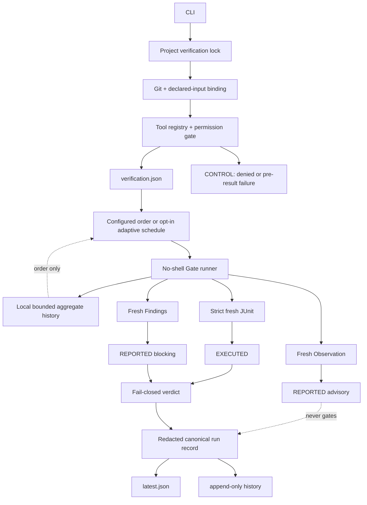
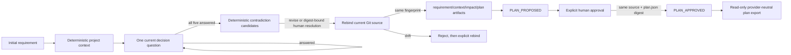

# Architecture

## Product boundary

Backend Team Harness closes one gap: a claim that a backend change works must be tied to the exact source, declared inputs, commands, toolchain, and fresh machine-readable results that produced it.

It is not a model host, CI replacement, deployment platform, production database client, full static-analysis oracle, or sandbox for malicious repositories.

## Runtime



`bth check` uses the explicit `CHECKING` operation. It does not forge a persisted task. `bth verify` first requires an approved task and uses `VERIFYING`.

## Native planning interview



The interview is native BTH behavior, not a runtime bridge to another harness or an LLM. Its question catalogue and transitions are versioned in `interview-state.mjs`. It records only explicit human decisions and deterministic repository observations; it does not claim semantic code impact that no tool or person established.

Project intelligence adds strict `.backend-harness/project-rules.json` and `.backend-harness/project-facts.json` contracts. Built-in facts come from bounded repository inspection. Company-specific facts must use `project.*`, cite a regular project-contained Markdown file and exact heading, and carry source SHA-256 plus provider/version authority. Project facts cannot replace built-in ids or create verdict authority. Agreeing providers merge; disagreement becomes `conflict`. Rule evaluation is deterministic; an absent or conflicting fact cannot be promoted to confirmed. Blocker rules prevent interview finalization until the source is corrected and rebound.

Doctor and JVM inspection share one deterministic bounded project manifest instead of independently walking the same tree. `intelligence inspect` is still read only. The separate `intelligence warm-cache` command may atomically write one sealed local JVM index under `.backend-harness/local/cache/`; exact fingerprint hits read no source files, while source drift uses Git status plus cached/current HEAD diff to parse only changed JVM paths. Reuse is refused for ignored JVM sources, submodule-owned indexed sources, assume-unchanged/skip-worktree paths, unsafe cache paths, invalid seals, or oversized records. Cache data has no PASS or test-skipping authority.

The legacy-named `quality-gates/*.yaml` files are human review checklists. They are parsed into planning context but are not executable and have no verdict authority. Machine-enforced Gates exist only in `verification.json`.

Interview persistence is under the owning task. `events.jsonl` is append-only and hash-chained, project-context snapshots are stored by digest, the four JSON artifacts are SHA-256 bound, and path/symlink/size limits match the existing task safety model. `unknown` and `conflict` answers remain the current question and fail closed. Project observations specialize the question hints but never create a human answer. Optional question-scoped claims are bounded booleans/identifiers; Core derives only enumerated contradiction candidates and never infers them from prose. A candidate must disappear after revision or receive an actor/reason/time resolution bound to both its digest and the current context-snapshot digest. `revise` changes one explicit decision; `rebind` preserves decisions while recording a fresh source and immutable context snapshot, but invalidates old candidate resolutions.

Finalization is crash-recoverable across the interview and task stores: finalized artifacts are authoritative and a retry may finish materializing the unchanged task plan. The resulting task enters `PLAN_PROPOSED`, never `PLAN_APPROVED`. Approval checks the planned source fingerprint and canonical `plan.json` digest, then records context/plan/artifact hashes plus actor and time. Any later context or plan update clears that receipt. The provider-neutral export is read-only and explicitly carries neither write authority nor verdict authority.

## Layers

### Generic Core

- `source-binding.mjs`: project-scoped HEAD manifest, diff, untracked, and explicit-input fingerprints
- `project-lock.mjs`: cross-process build/report ownership
- `process-runner.mjs`: allowlisted environment, no shell, timeout/process-group cleanup
- `junit.mjs`: bounded discovery, freshness, strict XML parsing, executed-count semantics
- `findings.mjs`: bounded project-relative Findings/Observation ingestion
- `toolchain.mjs`: executable hashes, Java and wrapper metadata
- `canonical-json.mjs`, `redaction.mjs`: stable hashes and shareable-record hygiene
- task state/store, evidence store, and run-record store
- native interview state/store and source-bound plan artifacts

### Configured adapter

`verification-tool.mjs` knows result contracts, not frameworks. It resolves each project-contained executable, selects configured order or an opt-in schedule, fails fast after a required failure, and rebinds source after execution.

Adaptive scheduling is deliberately narrower than test-impact analysis. Only contiguous required Gates marked `reorderable: true` can move inside the declared Gate dependency DAG. With Beta-smoothed failure probability `p_i` and observed mean duration `c_i`, dependency-free sequential segments use descending `p_i/c_i`, the pairwise optimum for the declared independent fail-fast model. Dependency-constrained sequential segments of at most 18 Gates use exact dynamic programming over topological states with recurrence `E(S)=min_i(c_i+(1-p_i)E(S∪{i}))`. Larger DAGs and parallel execution use an explicitly labeled ready-set heuristic rather than claiming global optimality. A fixed or optional Gate is a hard boundary. Insufficient, missing, unsafe, or corrupt local history preserves configured order. The scheduler never removes a Gate and cannot alter evidence or verdict authority.

Execution remains serial by default. A project may opt in to bounded parallel batches only when Gates declare `parallelSafe: true`, distinct `resourceClass` values, and no dependency between batch members. The selected batches and resource classes are preserved in the run record. This declaration is a project-owned trust statement; BTH cannot prove that arbitrary build tasks avoid a hidden shared cache.

### Project contract and Packs

The project owns:

- command argv and timeout
- network declaration
- ignored but outcome-affecting input files
- JUnit/Findings report locations
- required/optional policy
- database lifecycle and test profile

Built-in Packs install this boundary; they do not bypass it.

## Evidence authority

```text
EXECUTED
├─ junit       may contribute positive PASS evidence
└─ exit-code   may prove a process step, never enough alone

REPORTED
├─ findings    may block PASS at declared severities
└─ observation may never change PASS

CONTROL
└─ permission denial or failure before a structured execution result; never PASS evidence
```

This is asymmetric on purpose. A static tool can detect a reason to stop, but “no findings” cannot prove runtime behavior.

## Verdict

```text
PASS = required gates all passed
   AND a required JUnit gate exists
   AND each required JUnit gate executed its minimum testcase count
   AND aggregate executed tests > 0
   AND failures = errors = 0
   AND source remained stable
```

`executed = testcase elements - truly skipped testcase elements`. A testcase containing failure/error is executed even if malformed producer output also includes `skipped`.

## Source and tool binding

Normal Git state does not include ignored inputs. The config therefore supports explicit `inputs`. Their path and content are hashed without writing their raw value into a run record. One bound file is limited to 32 MiB and all untracked/declared bound files together are limited to 256 MiB. The stream counts bytes while reading as well as checking initial file size, so a concurrently growing dump still fails closed.

For a backend nested in a monorepo, identity hashes the tracked HEAD manifest under that backend rather than the repository-wide commit id. A sibling-only commit therefore remains provenance metadata but does not invalidate an unchanged service. Committed task/local/generated harness records remain excluded from that manifest. The current binding also calculates the exact 0.7 fingerprint as compatibility metadata, allowing an unchanged already-approved/verified task to cross the 0.8 upgrade boundary without weakening new 0.8 identities.

Each run also binds the Gate executable content. Wrapper property files provide Gradle/Maven versions when present. A Java version probe is metadata only and cannot create PASS.

## Concurrency

All `check` and `verify` runs acquire `.backend-harness/local/locks/project-verification.lock` before binding source or touching reports. Public CLI task mutations, Pack installation, baseline updates, and approved-plan export use the same lock, so task approval/completion or graph reads cannot race an active verification. The lock records a stable host identity, PID, boot/process-start identity when the host exposes one, nonce, and time. A dead local process, recycled local PID, or same-host reboot remnant is recoverable immediately; a lock created on another host is never reclaimed from local PID evidence. Hosts without a start identity conservatively retain PID-only behavior. The nonce prevents one owner from releasing another owner's replacement lock.

Task state updates also retain narrower nonce-owned per-task locks for event-log serialization. Malformed crash remnants use a bounded five-second grace period, and task text/event history has explicit size/count limits so replay cannot grow without bound.

Local locks cannot serialize two independent clones. Shared task records therefore carry a single active `writerLease` for context, plan, implementation transitions, and implementation lifecycle changes. The first authoring actor claims epoch 0; `task handoff` changes the actor and increments the epoch in a hash-chained event. Human approval and deterministic verification remain separate signed roles and do not take this authoring lease. Before replay, BTH asks Git for unmerged entries below the task directory, including interview files. Any result fails closed with a conflict-resolution instruction; divergent hash chains are never auto-merged.

## Network and writes

Gate executables are trusted project code. A Gate declaring `network: true` is denied unless the caller explicitly supplies `--allow-network`. This is an approval latch, not an operating-system network sandbox. Credential variables remain absent from the child environment. A narrow set of routing/cache variables needed by local Docker/Testcontainers is preserved: Docker host/context/TLS paths, Testcontainers host/socket/image-prefix routing, rootless `XDG_RUNTIME_DIR`, standard proxy/no-proxy variables, and the Gradle/Maven/JDK paths. Registry authentication, cloud/database credentials, `DOCKER_AUTH_CONFIG`, `TESTCONTAINERS_RYUK_DISABLED`, and `TESTCONTAINERS_REUSE_ENABLE` are not passed.

The runner distinguishes a command deadline from leaked descendant stdio. After the direct process exits it allows a bounded drain; if a descendant still owns the pipes, BTH sends `SIGTERM`, waits a bounded grace period, escalates to `SIGKILL`, waits again, detaches stream listeners, and then finalizes output hashes. Cleanup is in a settle-guaranteeing `finally` path and the Gate fails as `process_stdio_drain_timed_out` instead of poisoning timeout history.

BTH has two optional source-writing ports after a source-bound plan is human-approved: a legacy project-owned command adapter and explicit built-in adapters for an installed Codex CLI or Claude Code. Provider configuration is still project-owned, requires fresh write/network approval, resolves only the two allowlisted CLI names through PATH, uses `shell: false`, and never supplies a dangerous sandbox-bypass flag. Provider authentication remains owned by the installed CLI; credential values are not copied into the request or evidence.

The provider receives a bounded local request in a detached task worktree under the current user's ownership-checked, mode-0700 state root outside the original repository. Deterministic `auto` routing uses only structured interview claims: explicit DB/migration/public-API risk selects deep; an explicit single-module/no-DB/no-public-API claim selects fast; missing evidence stays balanced. Large approved task text also escalates auto mode, and fast/balanced/deep reject task text above 8k/24k/64k characters instead of silently widening the prompt. Bounded ranked code context, approved plan, write limits, authority limits, and compact prior failure are supplied. The ignored request document is SHA-256 sealed before and after the provider run so it cannot be rewritten as unverifiable evidence. Numeric provider usage telemetry is advisory only. BTH then runs the complete configured Gate set; provider context routing never skips a Gate or creates PASS authority. Git necessarily updates the original repository's worktree-registration metadata, but the bound source is measured separately. Project configuration limits allowed prefixes, changed-file count, diff bytes, network declaration, timeout, and repair attempts. Isolated implementation currently rejects monorepo subdirectory roots explicitly; source binding supports those roots, but path-scoped implementation evidence does not yet. Provider subprocesses support already signed-in local CLI sessions; credential environment variables are deliberately excluded.

The original bound source is rebound before and after the run. Every isolated diff is measured against the immutable starting commit. Detached `HEAD`, shared branch/tag refs, assume-unchanged, and skip-worktree flags are checked, so an adapter cannot hide a write by restoring only `HEAD`. Changes to `verification.json`, declared inputs, the implementation adapter, or Gate executables are classified as control-plane tampering and never verified. Symlink implementation changes are rejected. A sealed `running` record is written before worktree materialization so interrupted allocation remains discoverable and resettable. A failed attempt can receive only a compact prior failure summary and retry within the configured bound; authentication, cost-budget, rate-limit, and CLI-compatibility failures stop immediately because an identical retry cannot repair them. Schema-v1 command adapters continue to receive their original schema-v1 request rather than the richer provider request. Passing the isolated check records the exact pre-Gate path inventory plus content/deletion/executable evidence. A Gate that changes candidate bytes, adds or removes a source path, changes refs, or sets hidden index flags taints the workspace: automatic recovery stops and an explicit reset is required. Tasks record whether `IMPLEMENTING` is manual or isolated; any active implementation record remains authoritative through plan edits and verification retries until it is explicitly reset or safely cleaned up. `bth verify` requires the complete Git diff against the immutable base, declared inputs, and file evidence to match exactly, including the absence of extra paths. `implement reset` is the explicit destructive recovery path for failed/obsolete runs: it removes the registered worktree, archives the sealed run, writes a sealed actor/time reset receipt, and appends the action to the task event chain. After integration is independently `VERIFIED`, `implement cleanup` removes the worktree while preserving a chained passed record, archived predecessor, and task event. This produces a reviewable diff, not a merge, commit, deployment, or production access. The adapter boundary is not an operating-system sandbox; malicious trusted project executables require a separate container/sandbox policy.

`bth diagnose` reads the latest hash-validated failed run and returns failed Gates, failed tests, the sealed rerun argv, and advisory next actions. It does not retry automatically and cannot alter a verdict.

## DB boundary

The project owns Testcontainers, Compose, embedded DB, migration, data setup, and teardown. BTH owns execution ordering, freshness, evidence authority, and the final verdict.

This prevents a universal Core lifecycle from conflicting with real service setup and keeps production access outside the default trust boundary.

## Advisory graph

The bundled graph Pack is a structural source graph, not a compiler or runtime call graph. It records multiple Java/Kotlin declarations per file, exact unique imports and declared inheritance/implementation, conservative field/constructor injection and test-name relations, route/table/role metadata, per-edge provenance, coverage gaps, weighted PageRank, allowed uses, and forbidden uses.

Approved plan export may derive bounded query-personalized context from that graph. It first requires a successful graph observation in the latest sealed project run, an unchanged source fingerprint, and matching report bytes/digest. Lexical path/type matches seed Personalized PageRank; propagation uses explicit provenance weights and half-weight reverse navigation. Strongest lexical seeds also drive bounded forward dependencies and reverse dependents. Iterative SCC analysis handles deep graphs without JavaScript recursion overflow. Selection has a hard character budget and remains `REPORTED/advisory`; heuristic injection/test edges never gain verdict authority.

Ranking changes are regression-tested against `impact-gold-v1`, a 50-node synthetic Java backend fixture with four requirements and human-declared relevant paths. The current fixture produces mean Recall@5 = 1.0 and Recall@20 = 1.0 through the production ranking API. This proves deterministic regression behavior on the fixture only; real multi-project accuracy remains unmeasured.

A richer future sidecar must remain rebuildable and advisory. Compiler/bytecode/runtime provenance should outrank heuristic edges, and no graph may silently choose fewer tests for a PASS run.

## Known boundary

The system detects accidental staleness and cooperative record tampering. It does not provide remote attestation, signed builders, OS isolation, or protection from a malicious project executable. Process-group cleanup and wrapper execution are exercised on POSIX. Windows uses portable logical wrapper names in shared configuration, resolves them to `.bat`/`.cmd` at execution time, launches them through `cmd.exe` with expansion-sensitive arguments rejected, and requests descendant-tree cleanup through `taskkill /T`. A Windows hosted-CI Gate runs the contract tests and the real Gradle example; local POSIX tests alone are not treated as Windows proof. Re-execution of a bound record is the final trust mechanism.
