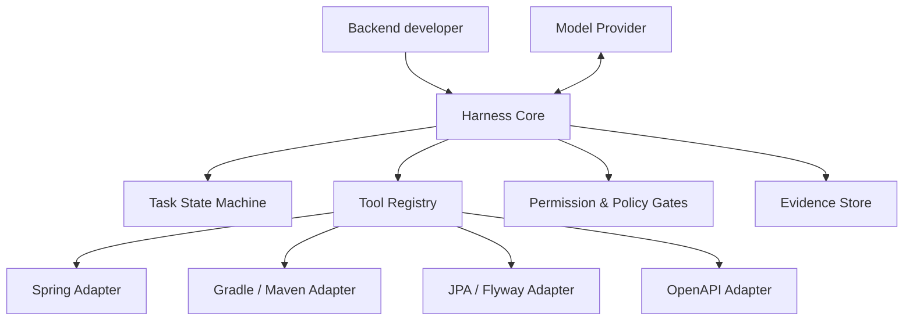

# Architecture

## Product boundary

Backend Team Harness coordinates a backend task from shared context to reproducible evidence. It is not a deployment platform, production database client, autonomous product manager, or replacement for human review.



## Planned layers

### Harness Core

- task lifecycle and resumable state
- structured tool invocation
- model-provider boundary
- permission checks and approval gates
- evidence and event recording

### Backend adapters

- Spring dependency and request-flow discovery
- Gradle and Maven build/test execution
- JPA entity, transaction, and query-risk inspection
- Flyway migration safety checks
- OpenAPI compatibility checks

### Project pack

A project pack supplies the domain language, repository map, commands, policies, and completion criteria for one team. It is configuration and documentation, not a fork of the core.

### Local state

Private task context, model transcripts, evidence, caches, and credentials live outside shared configuration and are ignored by Git.

## Planned task states

```text
CONTEXT_MISSING
  -> CONTEXT_READY
  -> PLAN_PROPOSED
  -> PLAN_APPROVED
  -> IMPLEMENTING
  -> VERIFYING
  -> VERIFIED
  -> DONE
```

Blocking states such as `CONTEXT_STALE`, `POLICY_BLOCKED`, `PERMISSION_DENIED`, and `VERIFY_FAILED` preserve evidence and prevent a false completion.

## Evidence rule

Model output is interpretation. A confirmed result requires evidence from a deterministic surface such as a file hash, compiler, test runner, schema comparison, or version-control diff.

